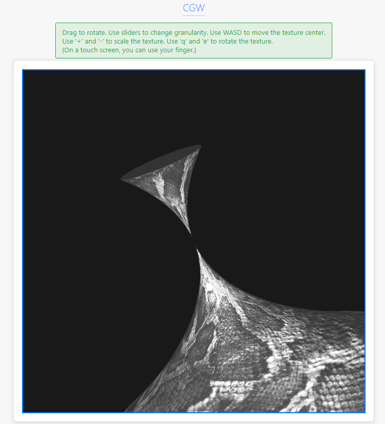

# Report: Texture Coordinate Transformations

## 1. Title Page

- **Title:** Implementation of Texture Coordinate Scaling and Rotation
- **Author:** Diana Bondareva
- **Variant:** 1 (Scaling)

## 2. Task Description

The objective of this task was to implement texture coordinate scaling around a user-specified point on a 3D surface. The user should be able to move this point across the surface's (u,v) parameter space using the keyboard. This report details the implementation and how to use the feature. The task also involved reusing existing texture mapping functionality.

The specific requirements were:
- Reuse texture mapping from a previous task.
- Implement texture coordinate scaling.
- Allow the user to move the center of scaling using 'W', 'A', 'S', 'D' keys.

## 3. Theory

### Texture Mapping

Texture mapping is a technique used in computer graphics to add detail, surface texture, or color to a computer-generated graphic or 3D model. A texture map is an image that is applied (or "mapped") to the surface of a shape or polygon.

### Texture Coordinates

Texture coordinates, commonly denoted as (u, v), are used to map a 2D texture image onto a 3D model's surface. These coordinates are associated with each vertex of the model. The u-coordinate typically represents the horizontal component of the texture, and the v-coordinate represents the vertical component. Both u and v are usually in the range [0, 1]. The graphics hardware then interpolates these coordinates for each pixel (or fragment) between the vertices, determining which part of the texture to sample for that fragment.

### Transformations on Texture Coordinates

Just like geometric transformations can be applied to vertices, transformations can also be applied to texture coordinates. This allows for effects like moving, scaling, or rotating the texture on the model's surface. These transformations are typically performed in the vertex shader.

To scale or rotate a texture around a specific point (`center`), the following sequence of transformations is applied to the texture coordinates (`texCoord`):

1.  **Translate to Origin:** The texture coordinates are translated so that the center of transformation is at the origin.
    `texCoord' = texCoord - center`
2.  **Scale and/or Rotate:** The scaling and/or rotation is applied. A scaling operation multiplies the coordinates by a scaling factor. A rotation operation multiplies the coordinates by a rotation matrix.
    `texCoord'' = S * R * texCoord'`
3.  **Translate Back:** The coordinates are translated back to their original position.
    `finalTexCoord = texCoord'' + center`

This ensures that the texture scales or rotates around the desired point, rather than the origin (0,0) of the texture space.

## 4. Implementation Details

Upon inspecting the provided codebase, it was discovered that the functionality for texture coordinate scaling, rotation, and translation of the center point was already implemented. The task then became to verify and document this existing implementation.

### JavaScript (`main.js`)

The main JavaScript file, `main.js`, handles user input and sends the necessary transformation data to the shader via uniforms.

**Keyboard Input Handling:**

The `handleKeyDown` function listens for keyboard events and updates the `texCoordCenter` and `texCoordScale` variables.

```javascript
function handleKeyDown(event) {
    const key = event.key;
    const step = 0.01;
    const scaleStep = 0.01;
    const rotationStep = 0.01;

    switch (key) {
        case 'a':
            texCoordCenter[0] -= step;
            break;
        case 'd':
            texCoordCenter[0] += step;
            break;
        case 'w':
            texCoordCenter[1] -= step;
            break;
        case 's':
            texCoordCenter[1] += step;
            break;
        case '+':
            texCoordScale += scaleStep;
            break;
        case '-':
            texCoordScale -= scaleStep;
            break;
        case 'q':
            texCoordRotation -= rotationStep;
            break;
        case 'e':
            texCoordRotation += rotationStep;
            break;
    }
}
```

**Passing Uniforms:**

In the `draw` function, these JavaScript variables are passed to the shader program's uniforms.

```javascript
// in draw() function
gl.uniform2fv(shProgram.iTexCoordCenter, texCoordCenter);
gl.uniform1f(shProgram.iTexCoordScale, texCoordScale);
gl.uniform1f(shProgram.iTexCoordRotation, texCoordRotation);
```

### Vertex Shader (`shader.gpu`)

The vertex shader receives the uniforms and applies the transformation to the texture coordinates as described in the theory section.

```glsl
// Vertex shader
attribute vec3 aVertex;
attribute vec3 aNormal;
attribute vec2 aTexCoord;
attribute vec3 aTangent;
attribute vec3 aBitangent;

uniform mat4 uModelViewProjectionMatrix;
uniform mat4 uModelViewMatrix;
uniform mat4 uNormalMatrix;

uniform vec2 uTexCoordCenter;
uniform float uTexCoordScale;
uniform float uTexCoordRotation;

varying vec2 vTexCoord;
varying mat3 vTBN;
varying vec3 vFragPos;

void main() {
    gl_Position = uModelViewProjectionMatrix * vec4(aVertex, 1.0);
    vFragPos = (uModelViewMatrix * vec4(aVertex, 1.0)).xyz;
    
    vec3 t = normalize((uNormalMatrix * vec4(aTangent, 0.0)).xyz);
    vec3 b = normalize((uNormalMatrix * vec4(aBitangent, 0.0)).xyz);
    vec3 n = normalize((uNormalMatrix * vec4(aNormal, 0.0)).xyz);
    vTBN = mat3(t, b, n);

    vec2 texCoord = aTexCoord - uTexCoordCenter;
    float cos_r = cos(uTexCoordRotation);
    float sin_r = sin(uTexCoordRotation);
    mat2 rotationMatrix = mat2(cos_r, -sin_r, sin_r, cos_r);
    texCoord = rotationMatrix * texCoord;
    texCoord = texCoord * uTexCoordScale;
    vTexCoord = texCoord + uTexCoordCenter;
}
```

The shader correctly translates the coordinates to the center, applies rotation, then scaling, and finally translates back.

## 5. User's Instructions

The application allows for full 3D interaction with the model and its texture.

-   **Rotate the model:** Click and drag the mouse on the model.
-   **Change model granularity:** Use the 'U range' and 'V range' sliders to change the number of segments in the parametric surface.
-   **Move the texture center:**
    -   Press 'W' to move the texture up.
    -   Press 'S' to move the texture down.
    -   Press 'A' to move the texture left.
    -   Press 'D' to move the texture right.
-   **Scale the texture:**
    -   Press '+' to zoom in (increase scale).
    -   Press '-' to zoom out (decrease scale).
-   **Rotate the texture:**
    -   Press 'Q' to rotate the texture counter-clockwise.
    -   Press 'E' to rotate the texture clockwise.



## 6. Sample of Source Code

### `main.js` - Keyboard Handling
```javascript
function handleKeyDown(event) {
    const key = event.key;
    const step = 0.01;
    const scaleStep = 0.01;
    const rotationStep = 0.01;

    switch (key) {
        case 'a':
            texCoordCenter[0] -= step;
            break;
        case 'd':
            texCoordCenter[0] += step;
            break;
        case 'w':
            texCoordCenter[1] -= step;
            break;
        case 's':
            texCoordCenter[1] += step;
            break;
        case '+':
            texCoordScale += scaleStep;
            break;
        case '-':
            texCoordScale -= scaleStep;
            break;
        case 'q':
            texCoordRotation -= rotationStep;
            break;
        case 'e':
            texCoordRotation += rotationStep;
            break;
    }
}
```

### `shader.gpu` - Vertex Shader
```glsl
const vertexShaderSource = `
    attribute vec3 aVertex;
    attribute vec3 aNormal;
    attribute vec2 aTexCoord;
    attribute vec3 aTangent;
    attribute vec3 aBitangent;
 
    uniform mat4 uModelViewProjectionMatrix;
    uniform mat4 uModelViewMatrix;
    uniform mat4 uNormalMatrix;

    uniform vec2 uTexCoordCenter;
    uniform float uTexCoordScale;
    uniform float uTexCoordRotation;

    varying vec2 vTexCoord;
    varying mat3 vTBN;
    varying vec3 vFragPos;

    void main() {
        gl_Position = uModelViewProjectionMatrix * vec4(aVertex, 1.0);
        vFragPos = (uModelViewMatrix * vec4(aVertex, 1.0)).xyz;
        
        vec3 t = normalize((uNormalMatrix * vec4(aTangent, 0.0)).xyz);
        vec3 b = normalize((uNormalMatrix * vec4(aBitangent, 0.0)).xyz);
        vec3 n = normalize((uNormalMatrix * vec4(aNormal, 0.0)).xyz);
        vTBN = mat3(t, b, n);

        vec2 texCoord = aTexCoord - uTexCoordCenter;
        float cos_r = cos(uTexCoordRotation);
        float sin_r = sin(uTexCoordRotation);
        mat2 rotationMatrix = mat2(cos_r, -sin_r, sin_r, cos_r);
        texCoord = rotationMatrix * texCoord;
        texCoord = texCoord * uTexCoordScale;
        vTexCoord = texCoord + uTexCoordCenter;
    }
`;
```
